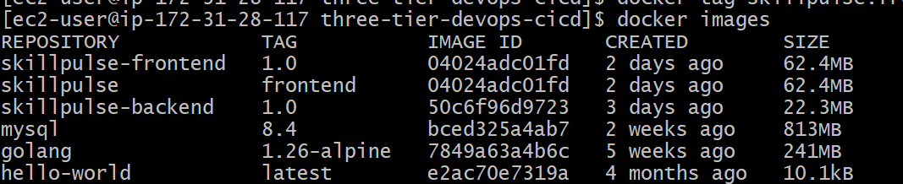
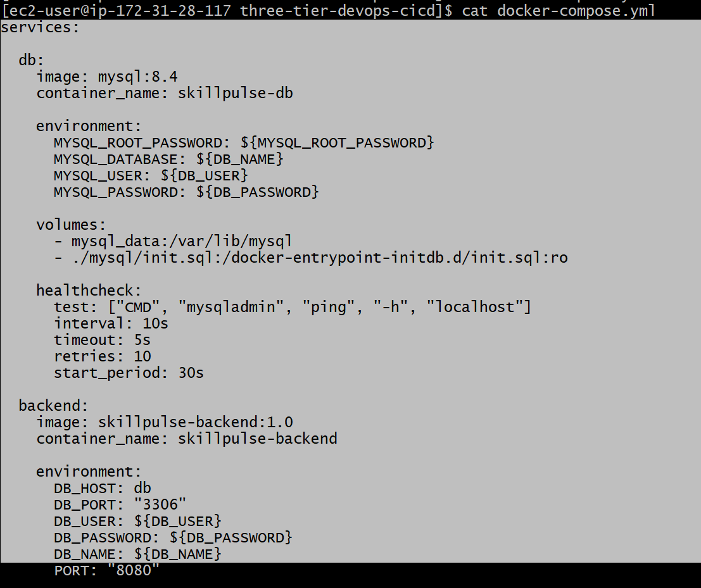
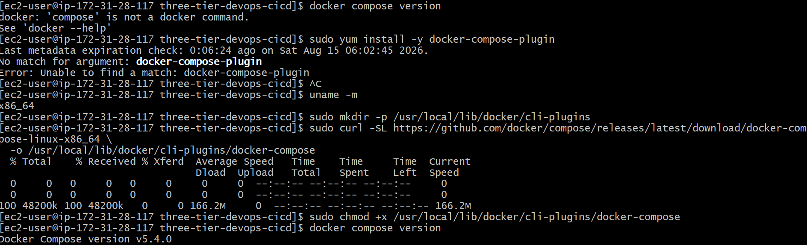
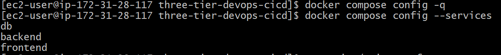
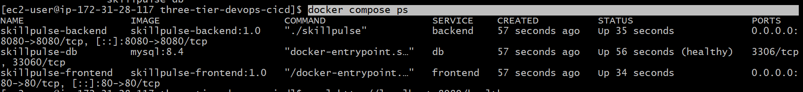
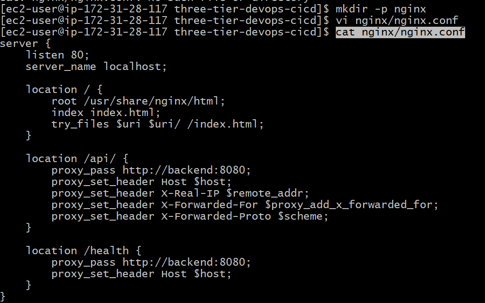
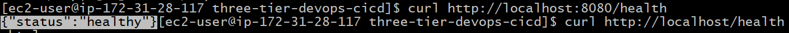
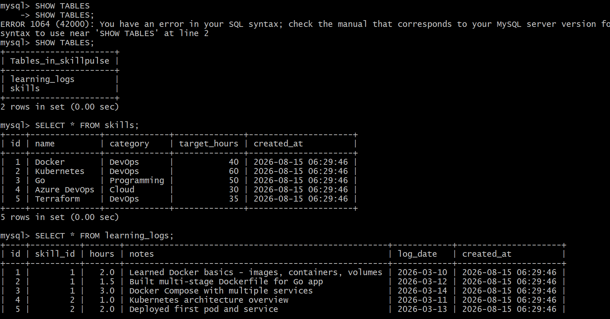
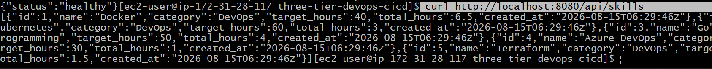
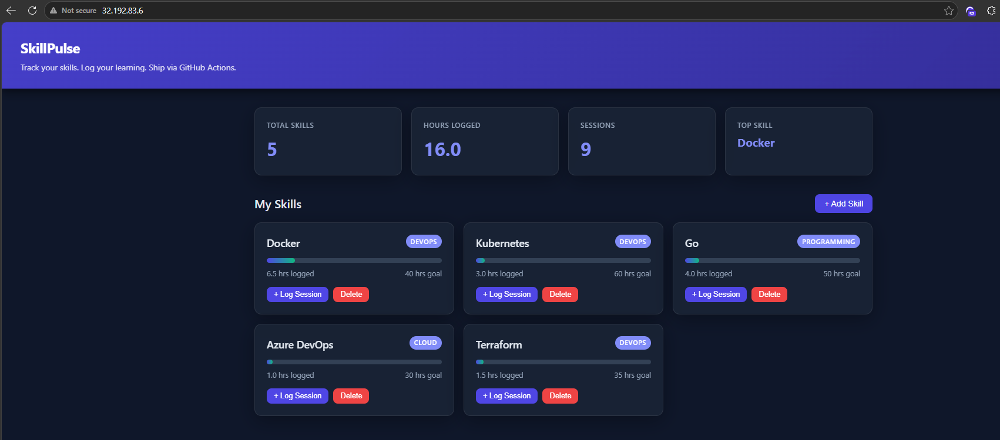

# Three-Tier DevOps CI/CD Project

End-to-end deployment and automation of a three-tier web application using Docker, AWS, Amazon ECR, Amazon EKS, Jenkins, and CI/CD practices.

## Application Overview

This project uses a three-tier web application consisting of:

- **Frontend** – HTML, CSS and JavaScript
- **Backend** – Go REST API using Gin
- **Database** – MySQL

The project focuses on containerization, cloud deployment, CI/CD automation, and operational troubleshooting.

## Architecture

The application will be progressively deployed using the following flow:

```text
Developer
    |
    v
  GitHub
    |
    v
 Jenkins
    |
    v
 Docker Build
    |
    v
 Amazon ECR
    |
    v
 Amazon EKS
    |
    +---- Frontend
    |
    +---- Backend
             |
             v
          MySQL / RDS

```

## Dockerfiles

The application is containerized using separate Dockerfiles for the backend and frontend.

### Backend Dockerfile

The backend uses a multi-stage Docker build. The Go application is compiled in a builder image and only the required binary is copied to the final lightweight image, reducing the final image size.

**Dockerfile:** `backend/Dockerfile`

---

### Frontend Dockerfile

The frontend uses Nginx to serve the application static files. The Docker image provides a lightweight web server for the frontend and is later configured as a reverse proxy for backend API requests.

**Dockerfile:** `frontend/Dockerfile`

---

### Docker Images Created

The following images were created and tested on the EC2 test server:

```text
skillpulse-backend:1.0
skillpulse-frontend:1.0
mysql:8.4
```


## Environment Variables

Docker Compose uses environment variables for database configuration.

Example:

```env
MYSQL_ROOT_PASSWORD=********
DB_NAME=skillpulse
DB_USER=skillpulse
DB_PASSWORD=********
```

The actual `.env` file contains sensitive credentials and is not committed to GitHub.

The `.env` file is added to `.gitignore`:

```text
.env
```


## Docker Compose

Docker Compose is used to run and manage the complete three-tier application as multiple containers.

Instead of starting each container separately using `docker run`, Docker Compose allows us to define the services, networking, environment variables, volumes, health checks and dependencies in a single `docker-compose.yml` file.

### Services

The Compose setup contains three services:

| Service | Image | Port | Purpose |
|---|---|---|---|
| db | mysql:8.4 | 3306 | Application database |
| backend | skillpulse-backend:1.0 | 8080 | Go backend/API |
| frontend | skillpulse-frontend:1.0 | 80 | Nginx frontend/reverse proxy |

### Application Flow

```text
Internet
   |
   | HTTP :80
   v
Nginx / Frontend
   |
   | backend:8080
   v
Go Backend
   |
   | db:3306
   v
MySQL
```





## Docker Compose Validation

Validate the Compose configuration:

```bash
docker compose config -q

```



# MySQL Database

MySQL is used as the database layer of the application.

The Docker Compose configuration uses:

```text
mysql:8.4
```

# Nginx Reverse Proxy

Nginx is used as the frontend web server and reverse proxy.

The Nginx configuration is stored in:

```text
nginx/nginx.conf
```




# Application Testing

## Backend Health Check

The backend service was tested directly using:

```bash
curl http://localhost:8080/health
```







